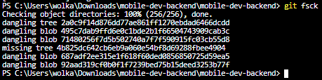
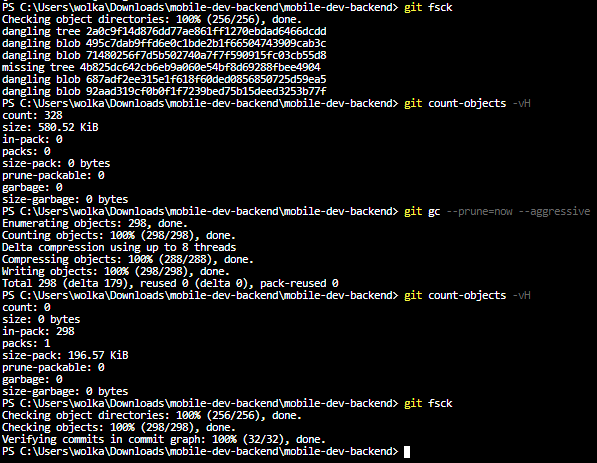

# Команды, используемые в лабораторной  работе
## Task 1

+ wsl --install
+ wsl --list --online

  

+ wsl --install -d Ubuntu-20.04
+ cd /mnt/c/Users/wolka/Downloads/mobile-dev-backend/mobile-dev-backend
+ sudo apt update
+ sudo apt install lighttpd
+ sudo apt upgrade
+ git config --global --add safe.directory /mnt/c/Users/wolka/Downloads/mobile-dev-backend/mobile-dev-backend
+ sudo apt install gitweb
+ git instaweb

## Task 2

+ git checkout ci
+ git rebase -i HEAD~2

  

  

  

  
+ git rebase master

  
+ git checkout master
+ git merge ci

  
+ git branch -D ci

  

## Task 3

+ git log --graph --oneline --reflog

  
+ git checkout aae7df3ec8096a0815f04212b809db7a0dbddd27

  
+ git switch -c old-master

  

## Task 4

+ git blame -L 32,+1 prisma/seed.ts

  

## Task 5

+ git bisect start
+ git bisect bad 12c17ba458a0d83b4eb5218aceff147b92a2aa2b
+ git bisect good 8673a61216986f4401c85c1b8448488911c2c678
+ npm run test
+ git bisect bad
+ npm run test 
+ git bisect good
+ npm run test 
+ git bisect bad 
+ npm run test
+ git bisect bad

  

  
+ git bisect reset

## Task 6

+ git filter-branch --force --prune-empty --index-filter "git rm -rf --cached --ignore-unmatch .env" --tag-name-filter cat -- --all
+ echo '.env' >> .gitignore

## Task 7

  
+ git filter-branch -f --env-filter "GIT_AUTHOR_NAME='Sidortsov Vladimir Sergeevich'; GIT_AUTHOR_EMAIL='TungFram@yandex.ru'; GIT_COMMITTER_NAME='Sidortsov Vladimir Sergeevich'; GIT_COMMITTER_EMAIL='TungFram@yandex.ru';" HEAD~3..HEAD

  

## Task 8

+ git config rerere.enabled true
+ git merge feature
+ git add .
+ git commit
+ git reset
+ git merge feature
+ git add .
+ git commit

  

## Task 9

+ git fsck

  

## Task 10

+ git fsck
+ git count-objects -vH
+ git gc --prune=now --aggressive
+ git count-objects -vH
+ git fsck

  

**Итоговая версия репозитория:**

## Task 11

  
+ git add docs/task(1-10).*
+ git add REPORT.md
+ git commit -a -m "feat: task(1-10) at REPORT.md"

  
